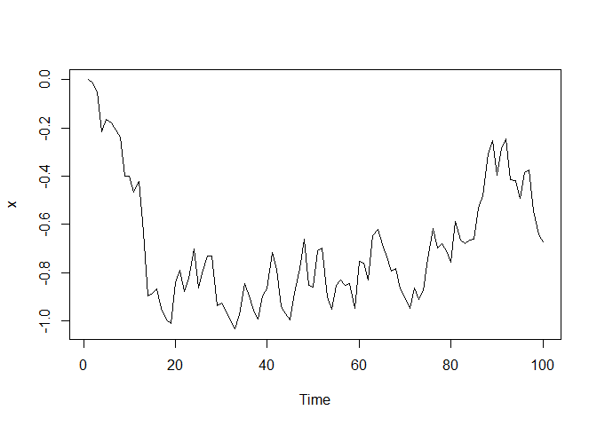
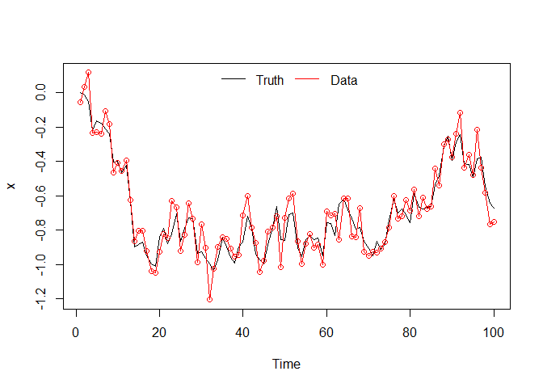
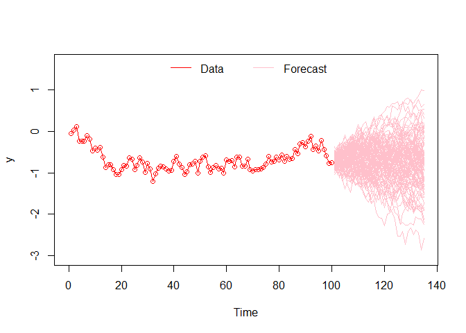
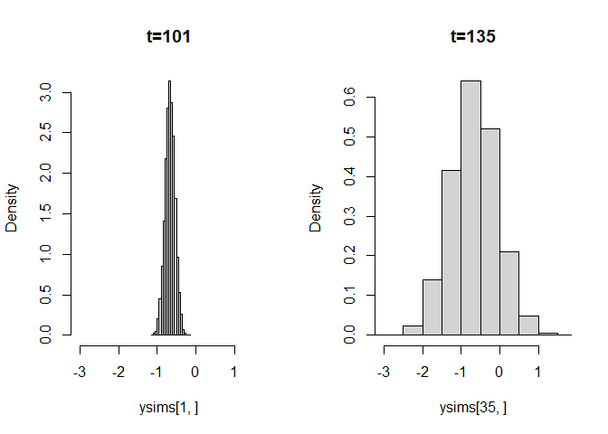

Random walk state-space model
================
Brett Melbourne
13 Apr 2021

The phenology challenge includes an example null model, which is a
random walk state-space model. The model is given and fitted to the data
in `2-nullModel_randomWalk_main.R`, where the Bayesian software JAGS is
used from within R, and the present script is commentary on that code.
The model is explained below.

## A basic random walk model

The random walk model says that the state of a variable at time
 is determined by its
state at the previous time plus a random deviation:

  
  

  
, ")  

where the random deviation
 is known as the process error and is assumed to have a
Normal distribution. Equivalently

  
. ")  

Simulating this model:

``` r
# Parameters
tmax <- 100       #Maximum time to simulate the model
x_1 <- 0          #Initial value for x (i.e. at time 1)
sd_proc <- 0.1    #Standard deviation of the process error

# Initialization
x <- rep(NA,tmax) #Vector to store x
x[1] <- x_1    #Initialize x

# Simulate process model
for ( t in 2:tmax ) {
    x[t] <- x[t-1] + rnorm(n=1,mean=0,sd=sd_proc)
}

# Plot results
plot(1:tmax,x,xlab="Time",type="l")
```

<!-- -->

In this model  is
the “truth”, i.e. the true state at time
. But what we observe is
. In other words,
 are the data.
The data are observed with error, which we call observation error.

  
  
  
, ")  

where  is the observation error, again assumed Normal. Equivalently

  
. ")  

Adding this observation error now to the simulation results from above:

``` r
# Parameter
sd_obs <- 0.08 #Standard deviation of the process error

# Simulate observation model
y <- x + rnorm(n=length(x),mean=0,sd=sd_obs)

# Plot results
plot(1:tmax,x,xlab="Time",type="l",ylim=c(min(x,y),max(x,y)))
lines(1:tmax,y,col="red")
points(1:tmax,y,col="red")
legend("top",c("Truth","Data"),lty=c(1,1),col=c("black","red"),bty="n",horiz=TRUE)
```

<!-- -->

The goal of a state space model is to estimate both process and
observation parameters and potentially to predict the state. “State”
refers to the true state of the world, and “space” refers to the
possible values (probabilistic) of this state.

In the basic random walk model above, we would need to estimate the
following parameters:
,
, . Let’s say that we used some method to estimate the parameters
and that the estimates were perfect. How would we forecast the model? We
could simply simulate the fitted model into the future:

``` r
# Model parameters
# x_1, sd_proc, sd_obs are as above

# Simulation parameters
fcst_horizon <- 35 #Forecast horizon is how far into the future
nsim <- 10000      #Number of simulations

# Setup
ysims <- matrix(rep(NA,fcst_horizon*nsim),nrow=fcst_horizon,ncol=nsim)
fcst_times <- (tmax+1):(tmax+fcst_horizon)

# Replicate simulations
for ( i in 1:nsim ) {
  x[fcst_times] <- rep(NA,fcst_horizon) #Extend x, keeping original series
  y[fcst_times] <- rep(NA,fcst_horizon) #Extend y, keeping original series
  # Simulate model
  for ( t in fcst_times ) {
      x[t] <- x[t-1] + rnorm(n=1,mean=0,sd=sd_proc)
      y[t] <- x[t] + rnorm(n=1,mean=0,sd=sd_obs)
  }
  ysims[,i] <- y[fcst_times]
}

# Plot data and forecast (up to the first 100 sims)
plot(1:tmax,y[1:tmax],xlab="Time",ylab="y",type="l",col="red",
     ylim=c(min(y,ysims),max(y,ysims)),
     xlim=c(0,tmax+fcst_horizon))
points(1:tmax,y[1:tmax],col="red")
for ( i in 1:min(100,nsim) ) {
  lines(fcst_times,ysims[,i],col="pink")
}
legend("top",c("Data","Forecast"),lty=c(1,1),col=c("red","pink"),bty="n",horiz=TRUE)
```

<!-- -->

We can now build an empirical distribution for the forecasted data. For
example, here are histograms (distributions) for the forecasted values
at  and .
You can see that the distribution for the longer time horizon is much
wider.

``` r
par(mfrow=c(1,2)) #2 panels in 1 row
hist(ysims[1,],freq=FALSE,xlim=c(min(ysims),max(ysims)),main="t=101")
hist(ysims[35,],freq=FALSE,xlim=c(min(ysims),max(ysims)),main="t=135")
```

<!-- -->

### Random walk model for phenology data

In the random walk model for the phenology data, they have in addition
that the observation error is time dependent, thus
, and these values are given in the dataset. In other
words, they are assuming that the observation error is known at each
time step (you could certainly improve on that assumption).

A Bayesian formulation is very natural for fitting this model and has
the additional benefit of accounting for parameter uncertainty. We need
priors for each of the parameters. For the phenology data, since
 is given as data, we need only to estimate two
parameters,  and
. For priors, they use a Normal distribution for
:

  
, ")  

where  appears to be judged by eye from the data, and a uniform
distribution for
:

  
. ")  

The above equations for the process model, observation model, and priors
can be seen to correspond directly to lines of code in the JAGS model
specification (the lines of code within `model{...}`). In the JAGS code,
 is known as `sd_add`, presumably for “additive process
error”. There are a few other lines of code in their JAGS model
specification. First, all the lines with `tau <- ...` are because the
spread parameter of the Normal distribution in JAGS is the precision
rather than standard deviation, i.e.

  
  

Finally, the lines

    tau_obs[1] <- 1 / pow(sd_obs[1], 2)
    y[1] ~ dnorm(x[1],tau_obs[1])

are part of the observation error model (i.e. not a prior) and are
needed because `t` in the `for` loop starts from 2, so `y[1]` is not
covered by the `for` loop.

To make a forecast for this model we would need values for
 for 
into the future. Since we can’t have data for these values as we do in
the past, they assume that
 in the future is the mean of
 in the past. This assumption is implicitly made in
these lines of code:

    d <- dplyr::full_join(d, full_time)

``` 
 d$p.sd[is.na(d$p.sd)] <- mean(d$p.sd,na.rm=TRUE) # Fill in NA values with the mean sd
```
