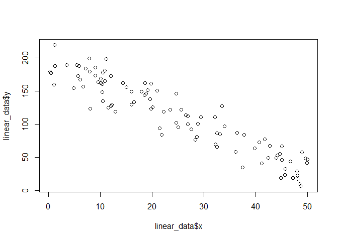
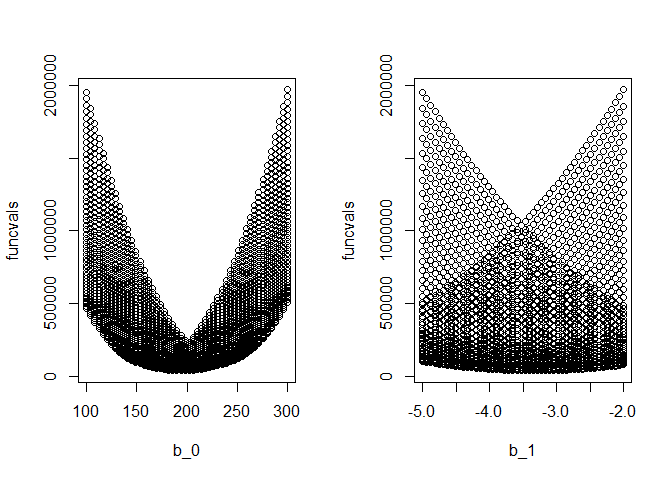
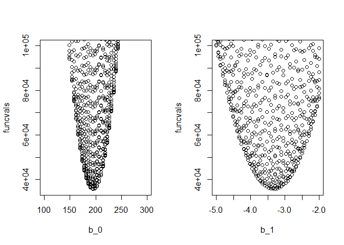
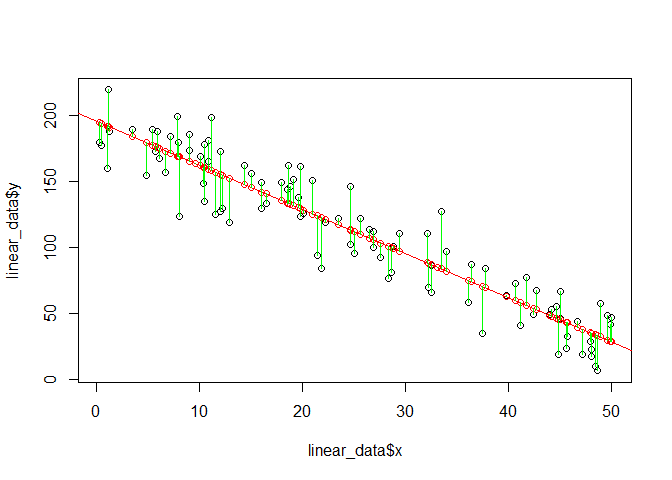

Tutorial on optimization
================
Brett Melbourne
16 Apr 2021

``` r
library(here) #for easy management of file paths within the repository
source(here("R/gridsearch.R")) #for gridsearch() function
```

## Background lecture on optimization algorithms

From week 3 of my data science class:

  - 10 min video lecture:
  - <https://www.dropbox.com/s/uyb8v9s2s5c1k92/wk3_vid1_optim_algos.mp4?dl=0>
  - Class notes:
  - <https://github.com/EBIO5460Fall2020/class-materials/blob/master/03_1_slides_optim_algos.pdf>

## Example: fitting a linear model

In the code below, I give an example that demonstrates using a grid
search followed by the Nelder-Mead descent algorithm to find the minimum
in the case of a simple linear model with sum of squares as the function
to be minimized (in other words, this is simple linear regression done
the hard way).

Model fitting has three components:  
1\) A function for the linear model.  
2\) A function to calculate SSQ.  
3\) A call to `gridsearch()` or `optim()`.

In this particular example, there is no strong advantage to separating
out the model from the SSQ function, or indeed for using a grid search
first, but this approach generalizes better to more complex models
(e.g. nonlinear dynamical models) so I demonstrate it here.

The functions `gridsearch()` and `optim()` are set up in the same way.
Read the help for `optim()`, noting how to pass parameters and data.
Parameters need to be in a vector and data need to be passed through the
“…” part of `optim()`.

``` r
?optim
```

See also the source code for `gridsearch()`. Open the file or you can
use:

``` r
file.show(here("R/gridsearch.R"))
```

### The data

Our goal is to fit a linear model to these data:

``` r
linear_data <- read.csv(here("R/OptimizingTutorial_data.csv"))
plot(linear_data$x,linear_data$y)
```

<!-- -->

### Function definitions

We need to define functions for the linear model and the SSQ.

``` r
# A function for the linear model. This is the model algorithm.
# Returns a vector of y for the model:
#    y = b_0 + b_1 * x
# b_0: y intercept
# b_1: slope
#
linmod <- function(b_0,b_1,x) {
    y <- b_0 + b_1 * x
    return(y)
}
```

``` r
# Returns the sum of squares for the linear model. This is set
# up for use with gridsearch() and optim().
# p:  vector of parameter values c(b_0, b_1) 
# y:  vector of data for y
# x:  vector of data for x
#
ssq_linmod <- function(p,y,x) {
    #In the next line we refer to the parameters in p by name so that the code
    #is self documenting
    y_pred <- linmod(b_0=p[1],b_1=p[2],x) #predicted y
    e <- y - y_pred #observed minus predicted y
    ssq <- sum(e^2)
    return(ssq)
}
```

### Grid search algorithm

First use a grid search algorithm to characterize the SSQ profile. From
the plotted data, it looks like a reasonable range to try for the
y-intercept is 100 to 300, and for the slope is -2 to -5.

Set up parameters to try (`gridsearch()` requires a list of vectors)

``` r
pvecs <- list(b_0=seq(100,300,length.out=50),
              b_1=seq(-2,-5,length.out=50))
```

Grid search

``` r
fit <- gridsearch(pvecs, ssq_linmod, y=linear_data$y, x=linear_data$x)
```

    ## [1] 10%
    ## [1] 20%
    ## [1] 30%
    ## [1] 40%
    ## [1] 50%
    ## [1] 60%
    ## [1] 70%
    ## [1] 80%
    ## [1] 90%
    ## [1] 100%

The best parameter values found by the grid search are in `fit$par`.
These are not the best possible values that could be found, only the
best found so far from the parameter combinations we tried.

``` r
fit$par
```

    ##        b_0        b_1 
    ## 193.877551  -3.285714

The minimum SSQ found so far is in `fit$value`.

``` r
fit$value
```

    ## [1] 35600.55

Plot SSQ profiles. The parameter combinations we tried and their SSQ
values are in `fit$profile`.

``` r
par(mfrow=c(1,2))
plot(funcvals~b_0,data=fit$profile)
plot(funcvals~b_1,data=fit$profile)
```

<!-- -->

The plot is too zoomed out so zoom in by adjusting the y-axis limits

``` r
par(mfrow=c(1,2))
ylim <- c(min(fit$value),100000)
plot(funcvals~b_0,data=fit$profile,ylim=ylim)
plot(funcvals~b_1,data=fit$profile,ylim=ylim)
```

<!-- -->

We see that the basin in the SSQ profile for each parameter is nicely
defined. In other words, the SSQ profile is nicely behaved with one
well-defined optimum. We expect this in the case of a simple linear
model but this can be super important for nonlinear models, where the
surface can be highly irregular and complicated by local minima.

### Nelder-Mead algorithm

Now we’ll use the Nelder-Mead descent algorithm with starting parameters
in the basin we just identified in the grid search.

Put the starting parameters in a vector

``` r
starts <- c(fit$par["b_0"],fit$par["b_1"])
```

Call `optim()` for Nelder-Mead

``` r
fit <- optim( starts, ssq_linmod, y=linear_data$y, x=linear_data$x )
fit
```

    ## $par
    ##        b_0        b_1 
    ## 195.010398  -3.327006 
    ## 
    ## $value
    ## [1] 35560
    ## 
    ## $counts
    ## function gradient 
    ##       67       NA 
    ## 
    ## $convergence
    ## [1] 0
    ## 
    ## $message
    ## NULL

`$par` gives the optimized parameter values.  
`$value` gives the minimum SSQ.  
`$counts` gives the number of times the function was evaluated.  
`$convergence` signals whether the algorithm converged (0 if it did
converge).

### Visualize the fit

Calculate fitted model for best parameter values. The values of `y` for
the best-fit parameters are also called “fitted values” or “predicted
values”.

``` r
y_pred <- linmod( b_0=fit$par[1], b_1=fit$par[2], linear_data$x )
```

Plot the fitted model with the data

``` r
par(mfrow=c(1,1))
plot(linear_data$x,linear_data$y)
points(linear_data$x,y_pred,col="red")
abline(fit$par[1],fit$par[2],col="red")
# Add the deviations if you want to be fancy
segments(linear_data$x,y_pred,linear_data$x,linear_data$y,col="green")
```

<!-- -->

### How does this relate to the lm() function?

R’s `lm()` function uses a different algorithm (householder algorithm
for QR decomposition to solve the system of linear equations) to find
the minimum SSQ. Here’s `lm()` for comparison.

``` r
lmfit <- lm(y~x,data=linear_data)
```

The estimated coefficients are the same as our `optim()` fit

``` r
lmfit
```

    ## 
    ## Call:
    ## lm(formula = y ~ x, data = linear_data)
    ## 
    ## Coefficients:
    ## (Intercept)            x  
    ##     195.009       -3.327

The minimum SSQ is the same (See Residuals: Sum Sq) as our `optim()` fit

``` r
anova(lmfit)
```

    ## Analysis of Variance Table
    ## 
    ## Response: y
    ##           Df Sum Sq Mean Sq F value    Pr(>F)    
    ## x          1 254514  254514  701.42 < 2.2e-16 ***
    ## Residuals 98  35560     363                      
    ## ---
    ## Signif. codes:  0 '***' 0.001 '**' 0.01 '*' 0.05 '.' 0.1 ' ' 1
